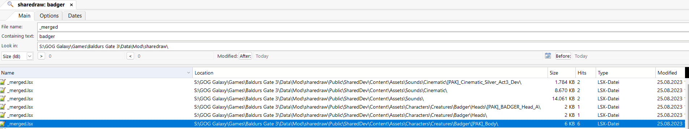

# Brief guide for models

## How to find the proper files and what to look for
1. I recommend Agent Ransack as a tool for doing this, you also need the LSlib toolkit and should convert your whole shared archive to convert .lsf into .lsx files. (Just batch convert .lsf into .lsx from the source shared directory you extracted from the game files into the same directory again)
2. Now in Agent Ransack choose your directory with all the extracted shared files from the base game + also the just extracted .lsf ones
3. Now as a file name put in "_merged", these are always the same files. For containing text you put the model you are looking for, in case for giant badger, its just badger. giant eagle is just called eagle for example
4. you will now find several _merged files, this is because they always get remerged from the lowest possible directory into the upper one. you always need to use the lowest possible _merged file and edit that
5. from my experience you are usually interested in the [Pak]_Body 

6. Now it gets confusing: these files that contain the information and basically define the models and their assets are contained in **public/modname/content/assets/...**
7. However, the actual models, animations, bodymaps etc. are contained in **public/modname/assets/...**
8. If you want to edit these files you will need to copy the _merged file for the desired model first into the corresponding directory, i have done that here. You can find it in **Public\DruidWildShapeOverhaul\Content\Assets\Characters\Creatures\Badger\[PAK]_Body\_merged.lsf.lsx**.
9. When you open this file, you can see that it is basically the original gamefile, however I have made two changes: I included both of your provided files and assigned them. The file locations should be ideally inline with the original relative paths, in this case the bodymap is found in **Public\DruidWildShapeOverhaul\Assets\Characters\_Models\_Creatures\Badger\Resources\BADGER_CUSTOM_BM.DDS** and the other file is in **Public\DruidWildShapeOverhaul\Assets\Characters\_Anims\_Creatures\Badger\Resources\BADGER_CUSTOM.GR2**. Note, that this is **NOT** in content/assets, but in assets.
10. In these files you can basically find everything we can edit, so you can look around for stuff, I haven't explored all the options yet. 